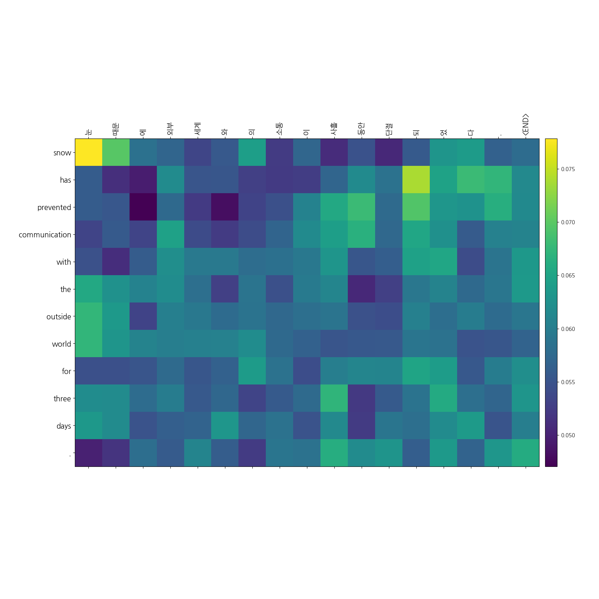

# Transformer model 실행 방법

`python Transformer.py [Arguments] ...`

Transformer.py는 **필수 인자**로 dataset이 저장된 folder를 전달해줘야 합니다.

`python Transformer.py -d "/foo/bar/dataset"`

---

dataset folder에는 아래의 file이 저장되어 있어야 합니다.

- **train_src.txt** : source data가 저장된 파일
- **train_tar.txt** : target data가 저장된 파일
- **src_word2id.pkl** : source data에 대한 단어 사전
- **tar_word2id.pkl** : target data에 대한 단어 사전
- test.txt (선택 사항) : 한 epoch가 끝나고 실행할 test data가 저장된 파일 (**형태소 분석이 완료된 파일이어야 함**)

train_src.txt와 train_tar.txt에 저장된 line은 서로 **1:1 대응**이 되야합니다. 만약 line 수가 다르다면 error가 발생합니다.  
dataset에 대한 예시는 repository의 dataset 폴더를 참고해주세요.  

---

- training에 사용한 예문들은 네이버 사전에서 크롤링했습니다.

---

---